HIS

HIS英文全称 hospital information system（医院信息系统），系统主要功能按照数据流量、流向及处理过程分为临床诊疗、药品管理、财务管理、患者管理。诊疗活动由各工作站配合完成，并将临床信息进行整理、处理、汇总、统计、分析等。本系统包括以下工作站：门诊医生工作站、药房医生工作站、医技医生工作站、收费员工作站、对帐员工作站、管理员工作站。基于Spring cloud和Spring boot 2.x 实现

**项目演示*

username：演示用户

password：test

``由于没有进行部署，首次加载需要等待1~2分钟，加载完成之后比较流程流畅``

``好不容易抓到了推免的尾巴，所以最近打算更新一下部署文档，暂时不打算再维护代码了，但我会继续推出其他有意思的基于Cloud的项目，欢迎关注``

``有问题请直接 issue（如果需要数据库和真实数据请联系本人邮箱）``

**申明**：项目为NEU实训课设本组所作，包前缀为neu，侵权必改
       

 **之前由于学校突然增加人机交互课设，所以把该项目变成Private,但很多人无情fork之后并不删除，例如  [TANGKUO](https://github.com/TANGKUO)，我已经联系他多次，他还是不删除。只能挂个名字在这了...**

**持续更新中......**

## 前言

HIS 项目致力于打造一个完整的医疗系统，采用现阶段流行技术实现。

下一阶段计划

1. 添置部署教程
2. 提高代码质量
3. 更新技术栈为最新版本，并引入新技术

本仓库包含

| 系统 | 描述         |
| ---------- | ---------------- |
| HIS-master | 单体应用         |
| his-cloud  | 分布式微服务应用 |
| HIS-web    | 诊疗前端           |
| HIS-app    | 患者前端 |

``注：单体应用和分布式实现业务完全相同``

## 一. 项目架构

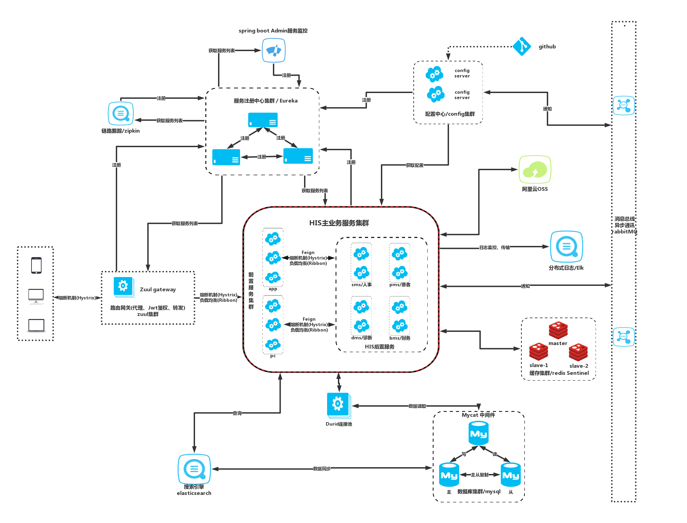

### 后端技术栈

| 技术                 | 版本             | 说明                 |
| -------------------- | ---------------- | -------------------- |
| Spring Cloud Netflix | Finchley.RELEASE | 分布式全家桶         |
| Spring Cloud Eureka  | 2.0.0.RELEASE    | 服务注册             |
| Spring Cloud Zipkin  | 2.0.0.RELEASE    | 服务链路             |
| Spring Cloud config  | 2.0.0.RELEASE    | 服务配置             |
| Spring Cloud Feign   | 2.0.0.RELEASE    | 服务调用             |
| Spring Cloud Zuul    | 2.0.0.RELEASE    | 服务网关             |
| Spring Cloud Hystrix | 2.0.0.RELEASE    | 服务熔断             |
| Spring Cloud Turbine | 2.0.0.RELEASE    | 服务熔断监控         |
| Spring Boot Admin    | 2.0.1            | 服务监控             |
| Spring Boot          | 2.0.3.RELEASE    | 容器+MVC框架         |
| Spring Security      | 5.1.4.RELEASE    | 认证和授权框架       |
| MyBatis              | 3.4.6            | ORM框架              |
| MyBatisGenerator     | 1.3.3            | 数据层代码生成       |
| PageHelper           | 5.1.8            | MyBatis物理分页插件  |
| Maven                | 3.6.1            | 项目管理工具         |
| Swagger2             | 2.7.0            | 交互式API文档        |
| Elasticsearch        | 6.2.2            | 搜索引擎             |
| kibana               | 6.2.2            | 数据分析和可视化平台 |
| LogStash             | 6.2.2            | 数据采集引擎         |
| RabbitMq             | 3.7.14           | 消息队列             |
| Redis                | 3.2              | 缓存                 |
| Druid                | 1.1.10           | 数据库连接池         |
| OSS                  | 2.5.0            | 对象存储             |
| JWT                  | 0.9.1            | 跨域身份验证解决方案 |
| Lombok               | 1.18.6           | 简化对象封装工具     |
| Junit                | 4.12             | 单元测试框架         |
| Logback              | 1.2.3            | 日志框架             |
| Java doc             | ————             | API帮助文档          |
| Docker               | 18.09.6          | 应用容器引擎         |
| Docker-compose       | 18.09.6          | 容器快速编排         |

### 前端技术栈

| 技术       | 版本        | 说明                |
| ---------- | ----------- | ------------------- |
| Vue        | 2.6.10      | 前端框架            |
| Vue-router | 3.0.2       | 前端路由框架        |
| Vuex       | 3.1.0       | vue状态管理组件     |
| Vue-cli    | ————        | Vue脚手架           |
| Element-ui | 2.7.0       | 前端UI框架          |
| Echarts    | 4.2.1       | 数据可视化框架      |
| Uni-app    | ————        | 跨平台前端框架      |
| Mockjs     | 1.0.1-beta3 | 模拟后端数据        |
| Axios      | 0.18.0      | 基于Promise的Http库 |
| Js-cookie  | 2.2.0       | Cookie组件          |
| Jsonlint   | 1.6.3       | Json解析组件        |
| screenfull | 4.2.0       | 全屏组件            |
| Xlsx       | 0.14.1      | Excel表导出组件     |
| Webpack    | ————        | 模板打包器          |

## 二. 项目展示
- 主页
   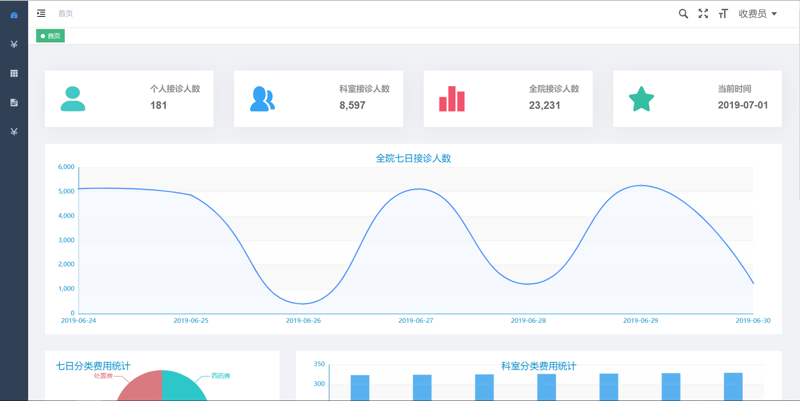

- 门诊医生工作台
    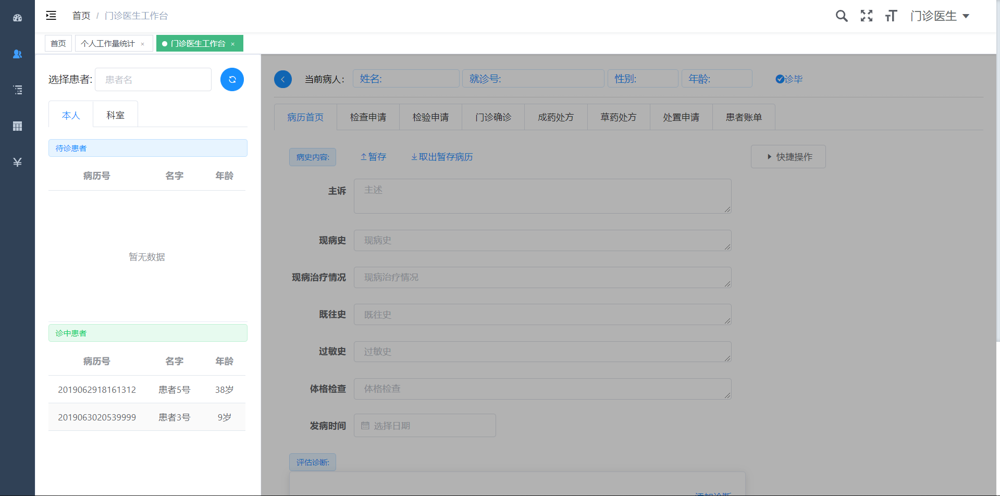

- 医技医生工作台
  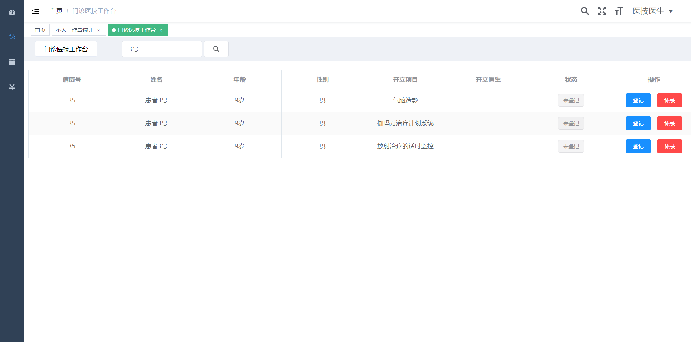

- 药房医生工作台
  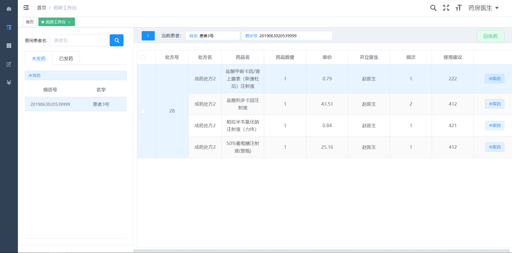

- 收银员工作台
  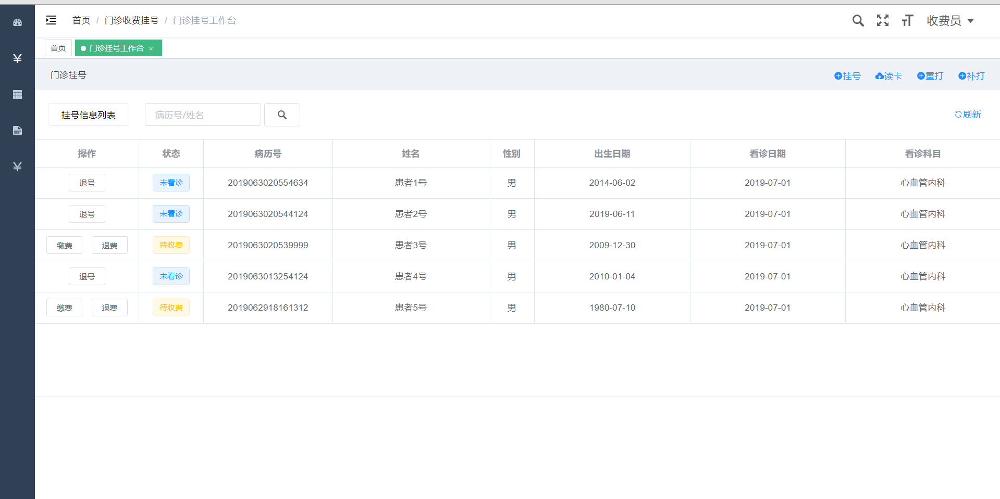

- 对账员工作台
  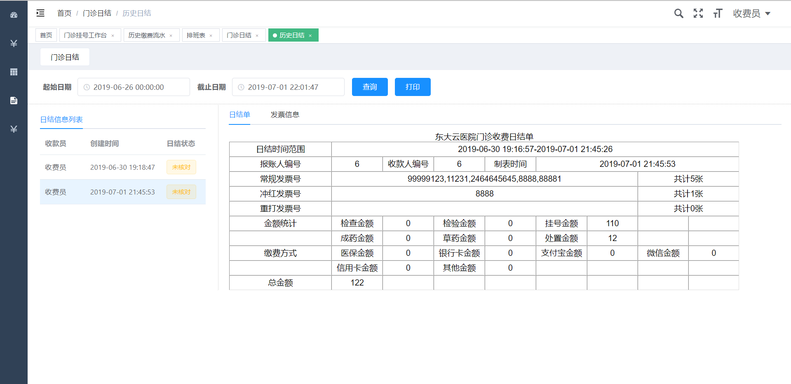

- 病历模板
  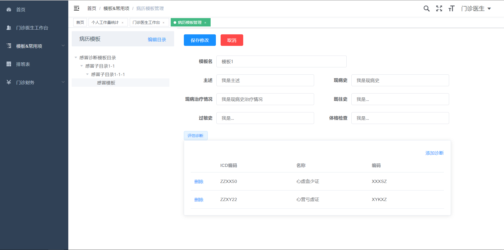

- 排班管理
  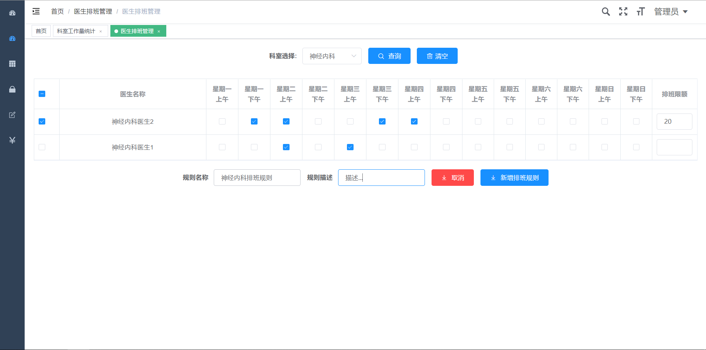

- App挂号
  

- Spring boot admin
  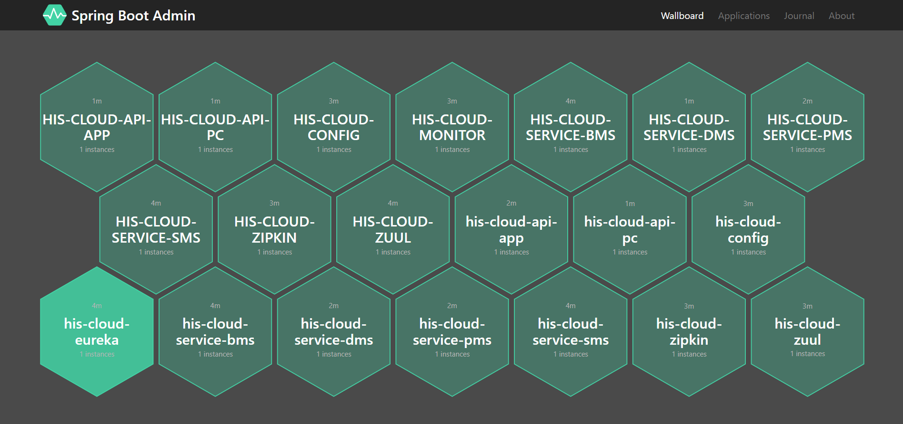

- Spring boot admin
  

- ZinKin链路追踪
  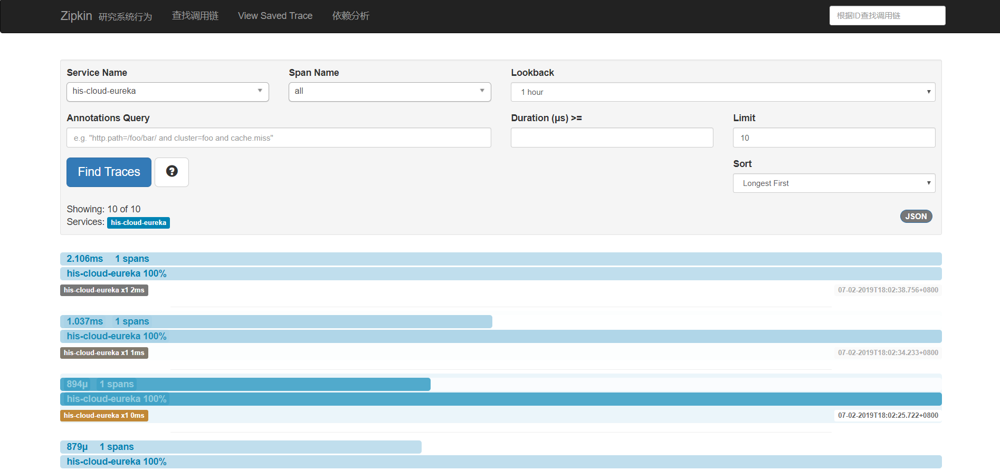

- 分布式日志收集
  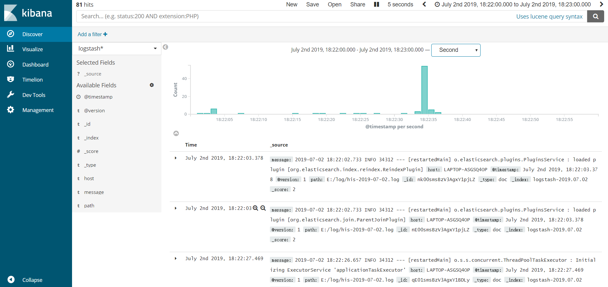

- Hystrix dashboard
  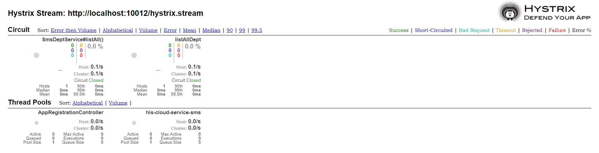

## 三. 环境搭建

### 开发工具

| 工具                     | 版本          | 说明                     |
| ------------------------ | ------------- | ------------------------ |
| IDEA                     | 2019.1.1      | 后端开发IDE              |
| WebStorm                 | 2019.1.1      | 前端开发IDE              |
| Visual   Studio Code     | 1.35.1        | 前端开发IDE              |
| HbuilderX                | V2.0.1        | 前端开发IDE              |
| Git                      | 2.21.0        | 代码托管平台             |
| Google   Chrome          | 75.0.3770.100 | 浏览器、前端调试工具     |
| VMware   Workstation Pro | 14.1.3        | 虚拟机                   |
| PowerDesigner            | 15            | 数据库设计工具           |
| Navicat                  | 11.1.13       | 数据库连接工具           |
| SQLyog                   | 12.0.3        | 数据库连接工具           |
| Visio                    | 2013          | 时序图、流程图等绘制工具 |
| ProcessOn                | ——            | 架构图等绘制工具         |
| XMind   ZEN              | 9.2.0         | 思维导图绘制工具         |
| RedisDesktop             | 0.9.3.817     | redis客户端连接工具      |
| Postman                  | 7.1.0         | 接口测试工具             |

### 部署教程

``待更新``

## 三. 业务需求

### 业务流程图

## 需求

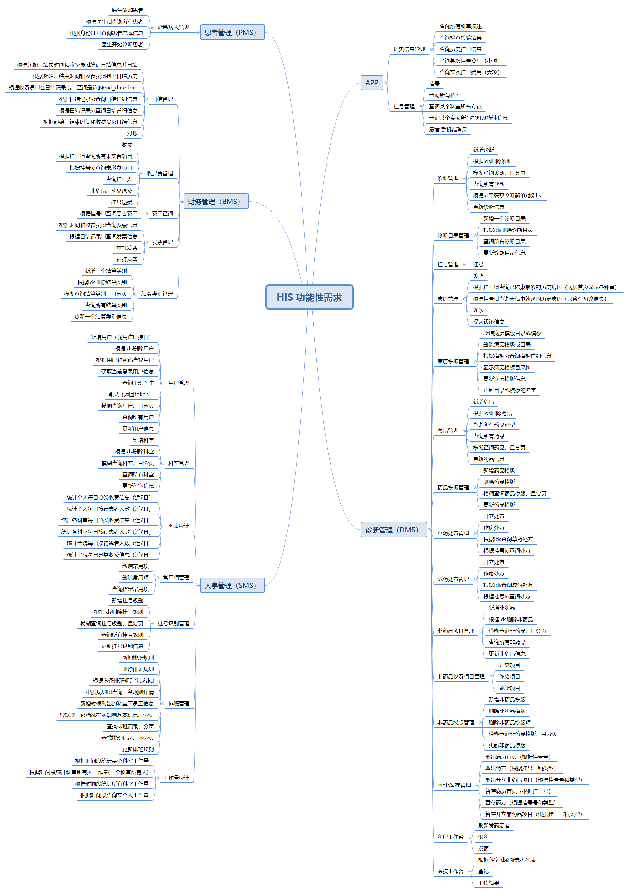

## 许可证

[Apache License 2.0](https://github.com/macrozheng/mall/blob/master/LICENSE)

Copyright (c) 2018-2019 ZainZhao